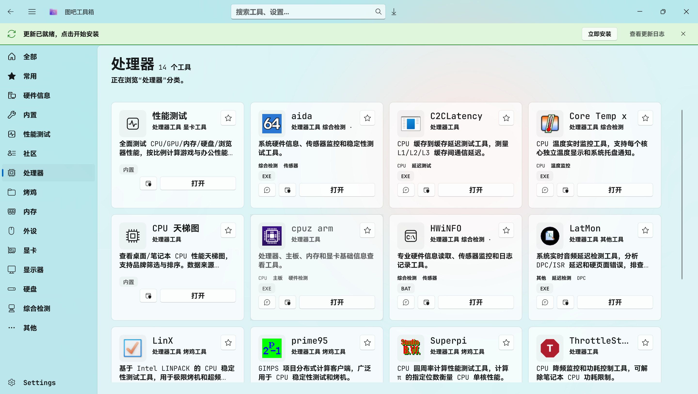

<div align="center">

[English](README_EN.md) | 中文


## 近期有许多非官方下载渠道，请注意甄别风险！
# 图吧工具箱 TubaWinUi3

**图吧工具箱的重构版** -- 基于 WinUI 3 / .NET 10 全新打造

<a href="https://readme-typing-svg.demolab.com?font=Fira+Code&size=28&pause=1000&color=0078D4&center=true&vCenter=true&width=600&lines=PC+%E7%A1%AC%E4%BB%B6%E5%B7%A5%E5%85%B7%E9%9B%86%E5%90%88;WinUI+3+%C2%B7+.NET+10;82+%E6%AC%BE%E5%B7%A5%E5%85%B7+%C2%B7+%E4%B8%80%E9%94%AE%E5%90%AF%E5%8A%A8">

</a>

[](LICENSE)
[](https://dotnet.microsoft.com/)
[](https://learn.microsoft.com/windows/apps/winui/)
[](https://github.com/luolangaga/tubatool)
[](https://gitcode.com/luolangaga/tubatool)
[](https://github.com/luolangaga/tubatool)

<a href="https://atomgit.com/luolangaga/tubatool"></a>
<a href="https://trendshift.io/repositories/51042?utm_source=trendshift-badge&utm_medium=badge&utm_campaign=badge-trendshift-51042" target="_blank" rel="noopener noreferrer"></a>
<a href="https://trendshift.io/repositories/51042?utm_source=trendshift-badge&utm_medium=badge&utm_campaign=badge-trendshift-51042" target="_blank" rel="noopener noreferrer"></a>

[官网文档](https://tubawinui3.cn) | [下载](https://github.com/luolangaga/tubatool/releases) | [反馈](https://github.com/luolangaga/tubatool/issues) | [讨论](https://github.com/luolangaga/tubatool/discussions)



</div>

---

## 目录

- [交流群聊](#交流群聊)
- [系统兼容性](#系统兼容性)
- [许可证](#许可证)
- [安装方式](#安装方式)
- [功能亮点](#功能亮点)
- [内置工具](#内置工具)
- [收录工具](#收录工具)
- [从源码构建](#从源码构建)
- [贡献者](#贡献者)

---

## 交流群聊

欢迎加入 QQ 群交流讨论：**485079194**

---

## 系统兼容性

| 平台 | 支持状态 |
|:----:|:--------:|
| x64 (Intel/AMD 64位) | ✅ 完全支持 |
| x86 (Intel/AMD 32位) | ✅ 完全支持 |
| ARM64 (高通骁龙等) | ✅ 原生支持 |

| Windows 版本 | 支持状态 |
|:------------:|:--------:|
| Windows 11 | ✅ 完全支持 |
| Windows 10 21H2+ | ✅ 完全支持 |
| Windows 10 1809+ | ✅ 最低支持 |

---

## 许可证

本项目采用 **GPL-3.0 + 附加条款** 开源协议。

- 源代码可自由使用、修改和分发
- 衍生作品必须以相同协议开源
- 详见 [LICENSE](LICENSE) 和 [LICENSE-ADDITIONAL](LICENSE-ADDITIONAL)

---

## 安装方式

### GitHub Releases（推荐）

前往 [Releases](https://github.com/luolangaga/tubatool/releases) 下载最新版本。

提供两种形式：
- **便携版 (ZIP)** -- 解压即用，无需安装
- **安装版 (Inno Setup)** -- 传统安装程序

### GitCode Releases（国内镜像）

国内用户可从 [GitCode 镜像](https://gitcode.com/luolangaga/tubatool) 下载，速度更快。

### Winget（Windows 包管理器）

```powershell
winget install luolangaga.tubatools
```

### Microsoft Store（微软商店）

<a href="https://apps.microsoft.com/detail/9P15095X7MGB?referrer=appbadge&mode=full" target="_blank" rel="noopener noreferrer">
	
</a>

---

## 功能亮点

<table>
<tr>
<td width="50%">

**一键启动工具**
自动扫描 `Tools/` 文件夹，按分类展示，点击即用

</td>
<td width="50%">

**实时搜索**
按名字或路径快速定位工具

</td>
</tr>
<tr>
<td width="50%">

**硬件信息**
WMI 读取 CPU、内存、显卡、硬盘、显示器等

</td>
<td width="50%">

**收藏夹**
常用工具加收藏，下次直接找

</td>
</tr>
<tr>
<td width="50%">

**管理员运行**
一键以管理员身份启动工具

</td>
<td width="50%">

**发送到桌面**
一键创建桌面快捷方式

</td>
</tr>
<tr>
<td width="50%">

**自动更新**
启动时静默检查，有新版本提醒

</td>
<td width="50%">

**主题切换**
亮色 / 暗色 / 跟随系统

</td>
</tr>
</table>

---

## 内置工具

> 采用 Fluent Design 构建的原生工具体系，无需依赖第三方软件

共 **26 款**内置工具，覆盖系统优化、硬件检测、网络诊断等场景：

| 分类 | 工具 |
|:----:|:-----|
| **系统工具** | 证书屏蔽 / 端口查看 / Hosts 编辑器 / 右键菜单管理 / 系统优化鸭 / Windows 激活 |
| **硬件检测** | 键盘测试 / 网速测试 / CPU 天梯图 / GPU 天梯图 / 硬件伪装 / 性能跑分 / 屏幕测试 |
| **网络工具** | WiFi 密码查看 / 网卡代理设置 |
| **清理维护** | 垃圾清理 / 电池报告 |
| **装机助手** | 新机装机向导 / UniGetUI / Windows 镜像工具 / 装机教程 / 文件传输 |
| **AI 辅助** | AI 助手 / 跑分云同步 / 防晕动症 |
| **社区工具** | 社区贡献工具入口（仅 unpackaged 模式） |

<details>
<summary>点击展开完整工具列表</summary>

### 系统工具
- **证书屏蔽** - 屏蔽/解除证书信任，防止软件被劫持
- **端口查看** - 实时查看 TCP/UDP 端口占用
- **Hosts 编辑器** - 可视化编辑系统 hosts 文件
- **右键菜单管理** - 管理上下文菜单冗余项
- **系统优化鸭** - Windows 性能/外观一键优化预设
- **Windows 激活** - KMS 激活，自动选择最优服务器
- **Defender 设置** - 快速打开 Defender 设置面板

### 硬件检测
- **键盘测试** - 可视化键盘按键检测
- **网速测试** - 下载测速文件，实时显示带宽
- **CPU 天梯图** - CPU 性能排行榜（桌面/笔记本）
- **GPU 天梯图** - GPU 性能排行榜（桌面/笔记本）
- **硬件伪装** - 修改注册表硬件 ID（备份/还原）
- **性能跑分** - CPU 烤机 + 实时温度频率监控
- **屏幕测试** - 屏幕坏点/色域/响应时间测试

### 网络工具
- **WiFi 密码查看** - 提取已保存 WiFi 密码
- **网卡代理设置** - 快速切换网卡代理

### 清理维护
- **垃圾清理** - 清理临时文件/浏览器缓存/Windows 更新缓存
- **电池报告** - 生成电池健康报告 HTML

### 装机助手
- **新机装机向导** - winget 批量安装常用软件
- **UniGetUI** - 包管理器统一界面
- **Windows 镜像工具** - PE/ISO 镜像管理
- **装机教程** - 新手装机图文教程
- **文件传输** -局域网文件快速传输

### AI 辅助
- **AI 助手** - 本地AI对话助手
- **跑分云同步** - 跑分结果云端同步对比
- **防晕动症** - 减少动画缓解晕动症

</details>

---

## 收录工具

> 共 **82 款**工具，覆盖硬件检测全场景

| 类别 | 数量 | 代表工具 |
|:----:|:----:|:--------|
| 处理器 | 9 | CPU-Z / Core Temp / Prime95 / LinX |
| 显卡 | 11 | GPU-Z / FurMark / DDU / NVFlash |
| 显示器 | 3 | 色域检测 / 屏幕测试 / UFO 测试 |
| 内存 | 7 | MemTest / TM5 / Thaiphoon / ZenTimings |
| 硬盘 | 20 | CrystalDiskMark / DiskGenius / HDTune |
| 烤鸡 | 2 | FurMark / FurMark 64 |
| 综合检测 | 5 | AIDA64 / HWiNFO / HWMonitor |
| 外设 | 7 | Keyboard Test / Mouse Rate / MouseTester |
| 其他 | 19 | Everything / Dism++ / Rufus / Ventoy |

完整工具列表详见 [官网文档](https://tubawinui3.cn)

---

## 从源码构建

```bash
git clone https://github.com/luolangaga/tubatool.git
cd tubatool
dotnet build        # 编译
dotnet run          # 运行（Unpackaged 模式）
```

<details>
<summary>环境要求</summary>

- [.NET 10 SDK](https://dotnet.microsoft.com/download/dotnet/10.0)
- [Visual Studio 2022 17.14+](https://visualstudio.microsoft.com/) 或 [VS Code](https://code.visualstudio.com/)（配合 C# Dev Kit）
- 最低支持 Windows 10 1809
- 支持 x86 / x64 / ARM64

</details>

---

## 贡献者

感谢所有为本项目做出贡献的开发者！

<a href="https://github.com/luolangaga/tubatool/graphs/contributors">
  
</a>

---

<div align="center">


<a href="https://www.star-history.com/?repos=luolangaga%2Ftubatool&type=date&legend=bottom-right">
  <picture>
    <source media="(prefers-color-scheme: dark)" srcset="https://api.star-history.com/chart?repos=luolangaga/tubatool&type=date&theme=dark&legend=bottom-right" />
    <source media="(prefers-color-scheme: light)" srcset="https://api.star-history.com/chart?repos=luolangaga/tubatool&type=date&legend=bottom-right" />
    
  </picture>
</a>

**如果觉得有用，给个 Star 吧！**

</div>